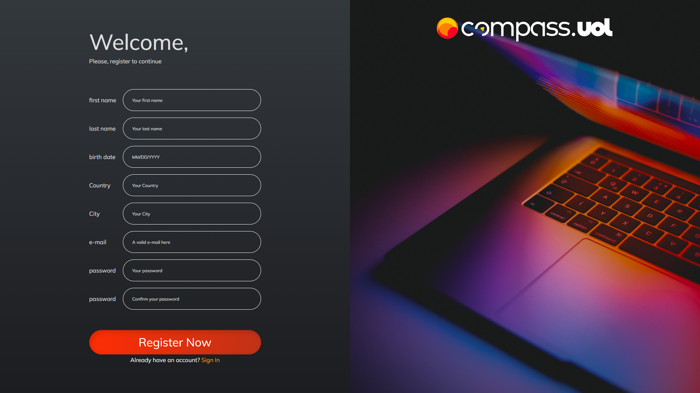
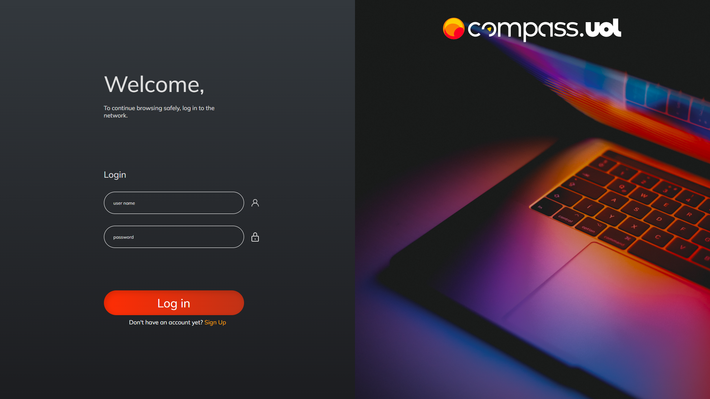
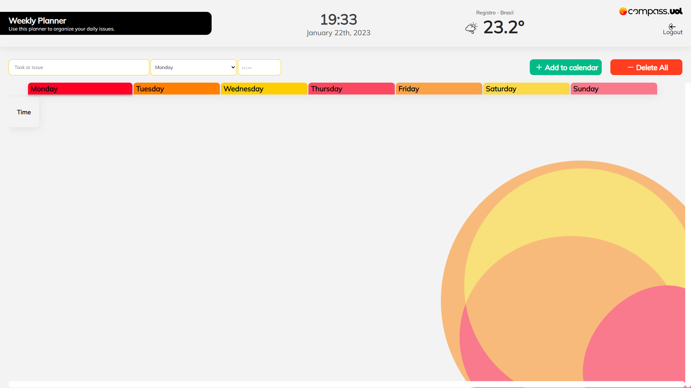
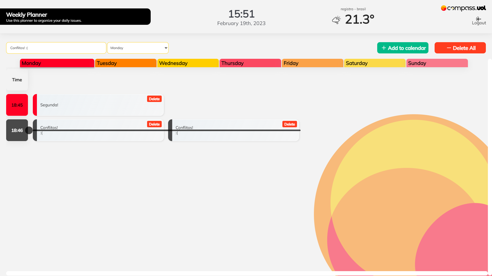

# Weekly Planner - Segundo projeto do Programa de Bolsas da Compass.UOL

## Como preparar o ambiente?

Antes de tudo, é necessário ter o NodeJS e o NPM instalado em seu computador. Basta instalar através desse <a href="https://nodejs.org/en/">link</a>.

---

Abra o terminal no diretório em questão e execute o seguinte comando:

```
npm install
```

Para rodar a aplicação em seu computador, utilize o comando:

```
npm run dev
```

# Navegando pela aplicação

## Tela de cadastro



## Tela de login



## Agenda



## Agenda com dados



## Funcionalidades

<ul>
    <li>Redirecionamento para o site da Compass em todas as logos.</li>
    <li>Validação de inputs do registro e login com JS + RegEx.</li>
    <li>Armazenamento dos inputs de cadastro em localStorage.</li>
    <li>Login através do nome completo + senha ou e-mail + senha que será buscado no localStorage. </li>
    <li>Rota de dashboard protegida com base no login.</li>
    <li>Horário e data atualizado no dashboard.</li>
    <li>Temperatura atual através do consumo da Weather API, também há uma validação caso a localização não exista.</li>
    <li>Validação dos inputs para adicionar a task.</li>
    <li>Cor do card dinâmico, baseado no dia da semana selecionado.</li>
    <li>Verificação de tasks em conflito (dia e horário iguais) com sinalização visual.</li>
    <li>Cards ordenados por tempo e filtrados através do tempo selecionado no topo.</li>
</ul>

## Tecnologias

<ul>
<li>HTML</li>
<li>CSS</li>
<li>JavaScript</li>
<Li>React</li>
<li>Styled-Components</li>
</ul>
